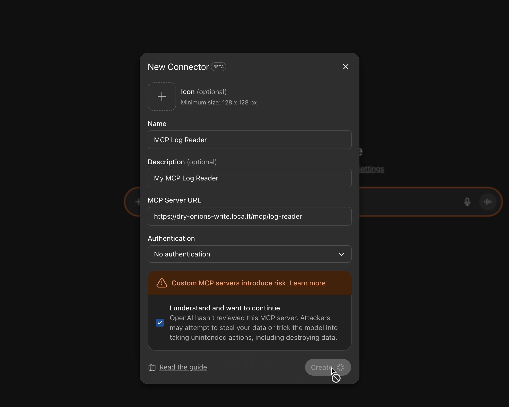
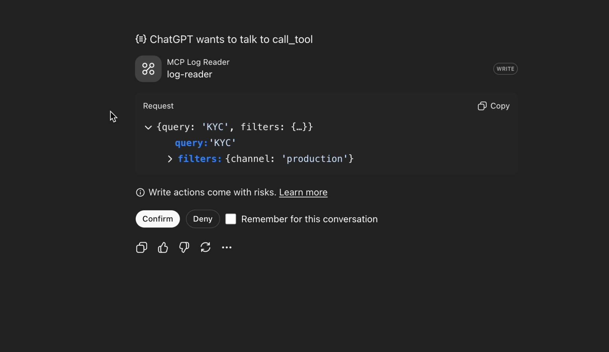

# Laravel MCP Log
MCP tool for Laravel log analysing with AI.

> This package uses the core log reading functionality provided by the [Laravel Log Reader](https://github.com/moe-mizrak/laravel-log-reader), so for the details about how the log reading works, please check that repository.

## Installation
You can install the package (that you created with this template) via composer:
  ```bash
  composer require laplace-demon-ai/laravel-mcp-log
  ```

You can publish the configuration file with:
  ```bash
  php artisan vendor:publish --tag="laravel-mcp-log"
  ```

## Configuration
You can enable/disable the MCP Log Reader as:
```php
'enabled' => env('MCP_LOG_READER_ENABLED', true),
```

The package supports two log storage drivers: `file` and `db` for now.

### Database Logs
If your logs are stored in database (`log_entries` table), in the config file (`laravel-mcp-log.php`) set the **driver** to `db` as:
```php
'driver' => env('LOG_READER_DRIVER', LogDriverType::DB->value),
```

And set the other database related configurations as:
```php
'table' => env('LOG_DB_TABLE_NAME', 'logs'),
'limit' => env('LOG_READER_DB_QUERY_LIMIT', 10000), // max number of records to fetch in queries

// Column mapping: maps DB columns to LogData properties
'columns' => [
    LogTableColumnType::ID->value => 'id',
    LogTableColumnType::LEVEL->value => 'level', // e.g. 'ERROR', 'INFO'
    LogTableColumnType::MESSAGE->value => 'message', // main log message
    LogTableColumnType::TIMESTAMP->value => 'created_at', // time of the log entry (e.g. 'created_at' or 'logged_at')
    LogTableColumnType::CHANNEL->value => 'channel', // e.g. 'production', 'local'
    LogTableColumnType::CONTEXT->value => 'context', // additional context info, often JSON e.g. '{"action":"UserLogin"}'
    LogTableColumnType::EXTRA->value => 'extra', // any extra data, often JSON e.g. '{"ip":172.0.0.1, "session_id":"abc", "user_id":123}'
],

'searchable_columns' => [
    ['name' => LogTableColumnType::MESSAGE->value, 'type' => ColumnType::TEXT->value],
    ['name' => LogTableColumnType::CONTEXT->value, 'type' => ColumnType::JSON->value],
    ['name' => LogTableColumnType::EXTRA->value, 'type' => ColumnType::JSON->value],
],
```

Basically we do a mapping between the database columns of your log table and the package, so that it can read the logs properly.

- The `searchable_columns` defines which columns are searchable and their types. It is used for the `search` queries. And we require `text` and `json` column types so that we choose the right search strategy (default is `text`).
- The `limit` defines the maximum number of records to fetch in queries to avoid performance issues.

### File Logs
If your logs are stored in files (`laravel.log`), in the config file (`laravel-mcp-log.php`) set the **driver** to `file` as:
```php
'driver' => env('LOG_READER_DRIVER', LogDriverType::FILE->value),
```

And set the log file path as:
```php
'path' => env('LOG_FILE_PATH', storage_path('logs/laravel.log')),
'limit' => env('LOG_READER_FILE_QUERY_LIMIT', 10000), // max number of lines to read
```

- The `path` defines the full path to your Laravel log file.
- The `limit` defines the maximum number of lines to read in queries to avoid performance issues

## Usage
This package automatically registers MCP Server (`LogReaderServer`) and MCP tool (`LogReaderTool`) in `LaravelMcpLogServiceProvider`, so you don't need to register it manually within the ai.php in your Laravel application.

> [!WARNING]
> You only need to install official [Laravel MCP package](https://github.com/laravel/mcp) so that MCP can recognize this server.

We defined the log reader endpoint as following in the `LaravelMcpLogServiceProvider`:
```php
Mcp::web('mcp/log-reader', LogReaderServer::class);
```

It means that you can access the log reader MCP tool in your MCP dashboard at `your-app-url/mcp/log-reader` URL.

Following is the video for a **quick demo** of how it works:

- This is how you can use [localtunnel](https://github.com/localtunnel/localtunnel) to expose your local Laravel application to the internet for MCP access:

[](https://youtu.be/DCo-NUpi6nU)

- And this is a demo of how the MCP Log Reader works with sample prompts:

[](https://youtu.be/F5ZP6u4WTW4)

## TODO (this is for [Laravel Log Reader](https://github.com/moe-mizrak/laravel-log-reader) )
> - [ ] Add a `log_insights` migration/table which will be a normalized, summarized, and searchable table.
  > - It unifies different log mechanisms into a single canonical format, enabling faster lookups over large data.
  > - A background task should sync new log data periodically, basically everyday it summarizes the previous day's logs and inserts them into `log_insights`.
  > - Be aware that summarization may lose some details (e.g., exact errors or stack traces).
> - [ ] Add support for cloud log readers (AWS CloudWatch, Azure Monitor, Google Cloud Logging).
> - [ ] Add streaming responses for overall logic.
> - [ ] Use a cheap/free model to summarize large log files before search/filter (experimental approach).
> - [ ] Laravel MCP Log can be integrated into coding agents where periodically logs are analysed by this tool, and issues are caught and reported to different channels (slack etc). And maybe even PRs can be generated by using the logs.

## Contributing

> **Your contributions are welcome!** If you'd like to improve this project, simply create a pull request with your changes. Your efforts help enhance its functionality and documentation.

> If you find this project useful, please consider ⭐ it to show your support!

## Authors
This project is created and maintained by [Moe Mizrak](https://github.com/moe-mizrak).

## License
Laravel Package Template is an open-sourced software licensed under the **[MIT license](LICENSE)**.
